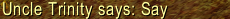
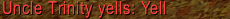
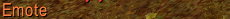
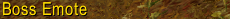
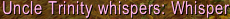
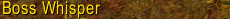

# creature\_text

# Tabla creature\_text

**Descripción breve:**

Esta tabla contiene todo el texto de voz (susurros, palabras, gritos, texto de gestos en burbujas de diálogo y en la ventana de chat) utilizado en la tabla [SMART\_SCRIPTS](http://www.azerothcore.org/wiki/smart_scripts) y en los scripts principales.

**Descripción detallada:**

¿Alguna vez te has preguntado cómo se crea un script para un jefe como ***Sindragosa*** (→ [wowhead](http://www.wowhead.com/npc=36853/sindragosa))? ¡No hace falta que te lo preguntes, puedes verlo tú mismo! (→ [Archivo de script de Sindragosa](https://github.com/azerothcore/azerothcore-wotlk/blob/master/src/server/scripts/Northrend/IcecrownCitadel/boss_sindragosa.cpp))

Ya lo sé, ya lo sé. ¡Esto parece increíblemente complejo, más de 1600 líneas de código! Sin embargo, no es necesario entenderlo todo de una vez. Centrémonos en algo simple, pero aun así muy importante, ¿de acuerdo?

Si miras el comienzo del código puedes encontrar una *enum* llamada Texts que está compuesta por 12 elementos (números del 0 al 11), veamos más de cerca el primer elemento de esta *enum*:

**boss\_sindragosa.cpp**  Expandir fuente

```cpp
 enum Texts
 {
     SAY_AGGRO = 0, // You are fools to have come to this place! The icy winds of Northrend will consume your souls!
     ...
 };
```

Puedes comprobarlo en el juego que ***Sindragosa*** gritará esto cuando inicies una pelea contra ella.
¿Notaste algo interesante? El texto real se coloca después de un //, lo que significa que esta información es un comentario y nuestro compilador la ignorará. Por otro lado, vemos claramente que está gritando ese texto, ¿cómo es posible?

## ¿Dónde se almacena esta información? ¿Cómo puedo encontrarla?

Podrías decir: «Bueno, esto tiene más de 1600 líneas, seguro que hay algo, pero aún no lo hemos encontrado».
Te aseguro que no encontrarás nada. Si no lo crees, usa el atajo Ctrl+F y ¡diviértete buscando!

¿No hay nada? Es una pena, pero quizás tuviste la oportunidad de descubrir algo.

**boss\_sindragosa.cpp**  Expandir fuente

```cpp
 void EnterCombat(Unit* victim) override
 {
     ...
     Talk(SAY_AGGRO); // interesting!
 }
```

¿Ves la última línea de esta función? ¡Están usando algo que no debería funcionar!
Podemos concluir que esta función se llamará cuando ***Sindragosa*** entre en combate (¡mira el nombre de la función!), así que ahora entendemos por qué grita al inicio.

Aún queda una pregunta fundamental: ¿dónde se almacena la información de este texto? La respuesta es más sencilla de lo que imaginas. ¡Se almacena en la tabla **CREATURE\_TEXT**!

*continuará...*

**Estructura**

| Campo                 | Tipo         | Atributos       | Llave | Nulo | Por defecto | Extra | Comentario                   |
|-----------------------|--------------|-----------------|-------|------|-------------|-------|------------------------------|
| [CreatureID][1]       | MEDIUMINT    | UNSIGNED        | PRI   | NO   |             |       | creature_template apuntación |
| [GroupID][2]          | TINYINT      | UNSIGNED        | PRI   | NO   |             |       |                              |
| [ID][3]               | TINYINT      | UNSIGNED        | PRI   | NO   |             |       |                              |
| [Text][4]             | longtext     | utf8_general_ci |       | SI   | NULL        |       |                              |
| [Type][5]             | TINYINT      | UNSIGNED        |       | NO   |             |       |                              |
| [Language][6]         | TINYINT      | UNSIGNED        |       | NO   |             |       |                              |
| [Probability][7]      | FLOAT        | SIGNED          |       | NO   |             |       |                              |
| [Emote][8]            | MEDIUMINT    | UNSIGNED        |       | NO   |             |       |                              |
| [Duration][9]         | MEDIUMINT    | UNSIGNED        |       | NO   |             |       |                              |
| [Sound][10]           | MEDIUMINT    | UNSIGNED        |       | NO   |             |       |                              |
| [BroadcastTextId][11] | MEDIUMINT    | SIGNED          |       | NO   |             |       |                              |
| [TextRange][12]       | TINYINT      | UNSIGNED        |       | NO   |             |       |                              |
| [comment][13]         | VARCHAR(255) | utf8_general_ci |       | SI   | NULL        |       |                              |

[1]: #creatureid
[2]: #groupid
[3]: #id
[4]: #text
[5]: #type
[6]: #language
[7]: #probability
[8]: #emote
[9]: #duration
[10]: #sound
[11]: #broadcasttextid
[12]: #textrange
[13]: #comment

**Descripción de los campos**

### CreatureID

Esta es la [creature\_template.entry](http://www.azerothcore.org/wiki/creature_template#creature_template-entry) a la que está vinculado el script.

### GroupID

Si hay más de una entrada igual (más de un texto que dice la criatura), esta columna se usa para elegir si es una palabra aleatoria o una lista ordenada. Si una criatura tiene más de un texto de palabra para mostrar en un orden determinado, debe incrementarse para cada nueva entrada coincidente (p. ej. 0, 1, 2, 3...). Si solo hay una entrada o solo un grupo, este valor debe ser 0. Si hay varios grupos de textos, este valor permanece igual dentro del grupo mientras que el id se incrementa dentro del mismo grupo.

Ejemplo de la Guardia de la Ciudad de Ventormenta, criatura 68:

| CreatureID | GroupID | ID  | Texto                                                                                                          |
|------------|---------|-----|----------------------------------------------------------------------------------------------------------------|
| 68         | 0       | 0   | ¡Prueba la cuchilla, mestizo!                                                                                  |
| 68         | 0       | 1   | Por favor, dime que no hiciste lo que creo que hiciste. Por favor, dime que no voy a tener que hacerte daño... |
| 68         | 0       | 2   | ¡Como si no tuviéramos suficientes problemas, vamos y creamos más!                                             |
| 68         | 2       | 0   | %s le arroja una manzana podrida a $n.                                                                         |
| 68         | 3       | 0   | %s le arroja un plátano podrido a $n.                                                                          |
| 68         | 4       | 0   | %s escupe en $n.                                                                                               |
| 68         | 5       | 0   | ¡Monstruo!                                                                                                     |
| 68         | 5       | 1   | ¡Asesino!                                                                                                      |
| 68         | 5       | 2   | ¡CONSIGUE UNA CUERDA!                                                                                          |
| 68         | 5       | 3   | ¡Cómo te atreves a poner un pie en nuestra ciudad!                                                             |
| 68         | 5       | 4   | Me das asco.                                                                                                   |
| 68         | 5       | 5   | Parece que nos van a ejecutar.                                                                                 |
| 68         | 5       | 6   | Traitorous dog.                                                                                                |
| 68         | 5       | 7   |¡Mi familia fue aniquilada por la Plaga! ¡¡¡MONSTRUO!!!                                                         |

### ID

Entrada para cada grupo de textos. Este es el identificador único cuando la entrada (criatura) es la misma y el groupid no cambia, debe incrementarse (ej. 0, 1, 2, 3...). Una criatura, por ejemplo, será seleccionada aleatoriamente de esta lista en función del groupid al que pertenece.

### Text

El texto que dirá la criatura.

### Type

| Valor | Valor antiguo | Localización     | Ejemplo de imagen                                        |
|-------|---------------|------------------|----------------------------------------------------------|
| 12    | 0             | Decir            |                     |
| 14    | 1             | Gritar           |                   |
| 16    | 2             | Ser emocionado   |          |
| 41    | 3             | Jefe Emote       |          |
| 15    | 4             | Susurro          |               |
| 42    | 5             | Susurro del jefe |  |

### Language

Valor de [Languages.dbc](Languages) (+ la tabla wiki del archivo dbc). Si se establece en 0, se usará el idioma predeterminado actual.

### Probability

Un valor de 1 a 100 que representa el porcentaje de probabilidad de que se ejecute este texto.

El valor debe ser >=0. Si el valor no cumple la condición, el SQL fallará en `creature_text_chk_1`.

### Emote

El emoticono que la criatura reproduce al ejecutar el texto. El valor de este campo se puede obtener del archivo [emote.dbc](Emotes).

### Duration

Tiempo en ms para ver el texto.
0 es el valor predeterminado y se calcula por núcleo.

### Sound

La entrada de sonido que esta criatura reproducirá al mismo tiempo que se ejecuta el texto. Los sonidos se encuentran en SoundEntries.dbc.

### BroadcastTextId

Id del texto equivalente encontrado en [broadcast\_text](broadcast_text)

### TextRange

| Valor | Rango                   |
|-------|-------------------------|
| 0     | Normal / Predeterminado |
| 1     | Área                    |
| 2     | Zona                    |
| 3     | Mapa                    |
| 4     | Mundo                   |

### comment

Este campo le permite etiquetar una entrada de texto.
