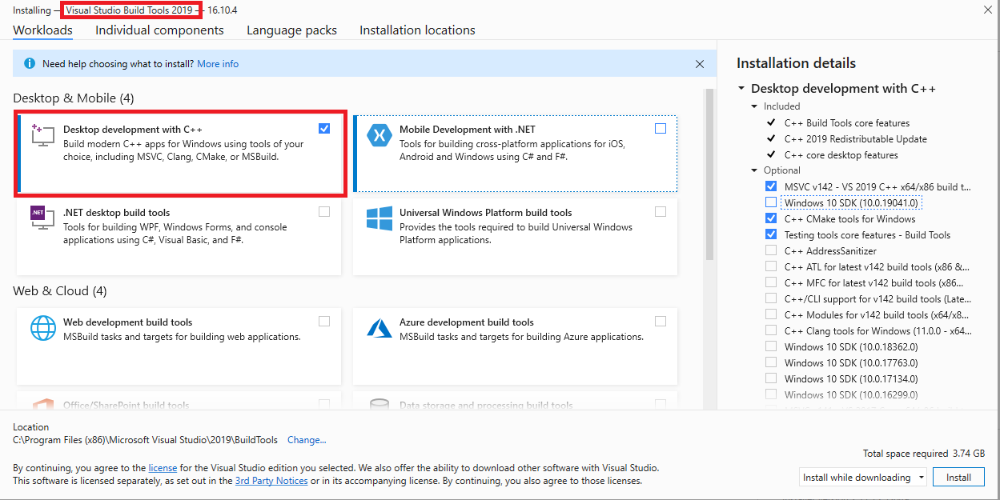
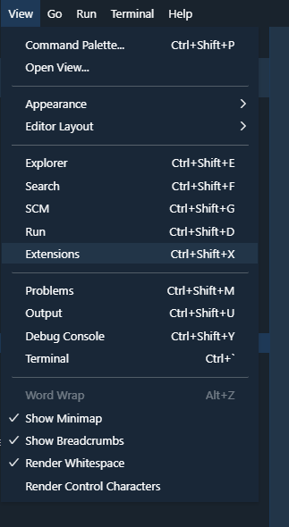
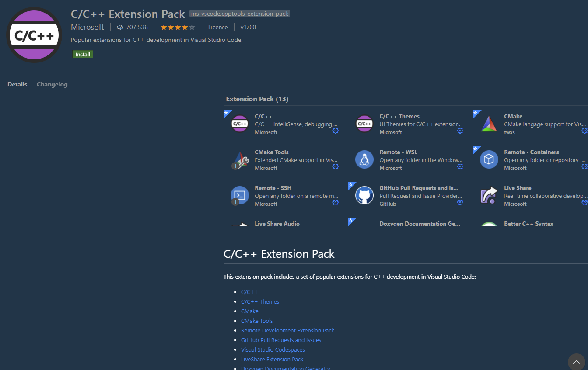

# VSC Requirements

| Installation Guide | |
| :- | :- |
| [<< Start: Installation Guide](installation) | [Step 2: VSC Core Installation >>](windows-vsc-core-installation) |

| |
| :- |
| Boost ≥ 1.70 - 1.74          |
| MySQL ≥ 5.7.0                |
| OpenSLL ≥ 1.0.x              |
| CMake ≥ 3.16                 |
| MS Visual Studio Build Tools |

1. Git Extensions
   
   1. You will need Git installed. You can get the latest version here https://git-scm.com/download/win
   
1. Install [Visual Studio 2019 Build Tools](https://docs.microsoft.com/en-us/visualstudio/install/create-an-offline-installation-of-visual-studio?view=vs-2019)

   You will need to install the C++ compiler.

   To do this, select **Desktop development for C++** under **Workloads -> Desktop & Mobile**.

   
   
1. [Visual Studio Code](https://code.visualstudio.com/)

	1. Download and install the **Latest Version**
	1. Install extensions
		1. Click **View**->**Extensions**
		
			
		1. In Search bar type **C/C++ Extension Pack**
		1. Click on green install button	
			
			

1. [CMake](https://cmake.org/)

    1. Download and install the **Latest Release** win32-x86.exe file, **NEVER the RC (Release Candidate) versions.**
    
    1. We recommend to compile in 64 bits mode. 

1. MySQL development files

    1. These files are shipped with MySQL Server, search for them at program files directory, MySQL\MySQL Server 8.0\lib / MySQL\MySQL Server 5.7\lib.

1. [OpenSSL](http://www.slproweb.com/products/Win32OpenSSL.html) Download the 64bit version. Or you can get both if you plan to compile both 32 and 64bit, they can coexist side by side.

    1. Find the 64bit version by finding the latest 1.0.x or 1.1.x Win64 OpenSSL that is NOT the "light" version. (Example: Win64 OpenSSL v1.1.1g)
    
    1. Find the 32bit version by finding the latest 1.0.x or 1.1.x Win32 OpenSSL that is NOT the "light" version. (Example: Win32 OpenSSL v1.1.1g)

    1. *Note #1: If you get a "Missing Microsoft Visual C++ 2008 Redistributable" error message while installing OpenSSL,*
       *download the [Microsoft Visual C++ 2008 Redistributable Package (x64)](http://www.microsoft.com/en-us/download/details.aspx?id=29) (1.7MB Installer) and install it.*
       *If you need 32bit support, download and install the [Microsoft Visual C++ 2008 Redistributable Package (x86)](http://www.microsoft.com/en-us/download/details.aspx?id=15336).*
       
    1. *Note #2: While installing OpenSSL, choose The OpenSSL binaries (/bin) directory (NOT "The Windows system directory")*
       *when given the choice on where to copy the OpenSSL DLLs. These DLLs will need to be located easily for [Core Installation](windows-core-installation).*

1. [Boost](https://www.boost.org/).

    1. Download the prebuilt Windows Binary for Visual Studio Tools

    1. `1.70.0` is the minimum version required for Visual Studio Tool, but Version `1.74.0`is recommended

    1. 64bit: https://sourceforge.net/projects/boost/files/boost-binaries/1.74.0/boost_1_74_0-msvc-14.2-64.exe/download

    1. 32bit: https://sourceforge.net/projects/boost/files/boost-binaries/1.74.0/boost_1_74_0-msvc-14.2-32.exe/download

    1. Add an environment variable to "System" variable named "BOOST_ROOT" and as value your Boost installation directory, e.g `E:/Programs/boost_1_74_0`. Important is to use '**/**', not '**\\**'  when pointing to directory. (Make sure that it does not have a trailing slash (end of path). If you still get problems, add the same variable in the `USER` variables section too, like shown in the image below.)

    

    1. Notice that this image shows the version number `1.72.0` - use your actual version number in your settings.
